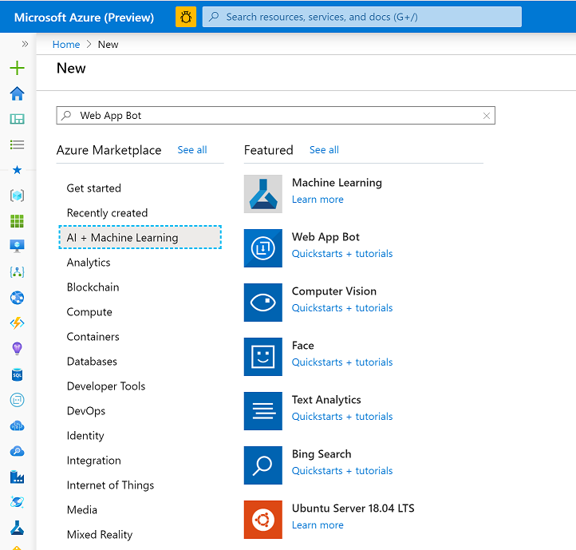
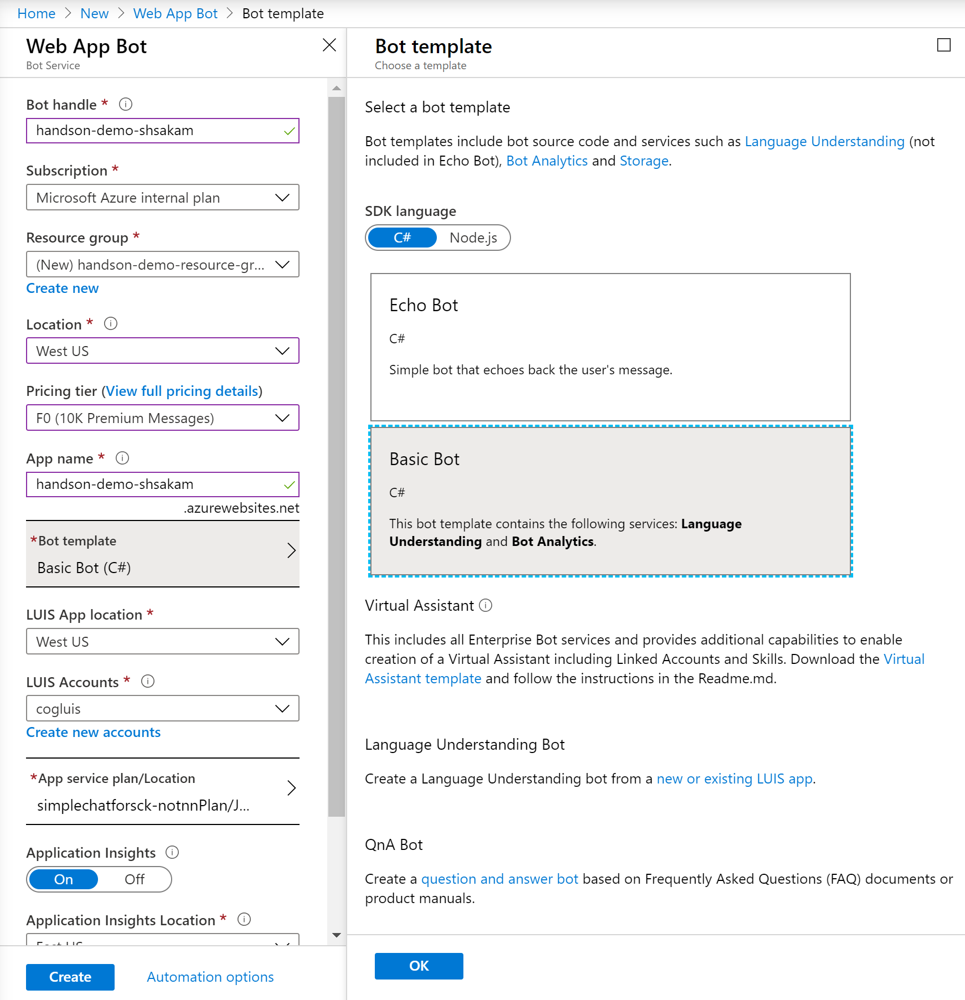
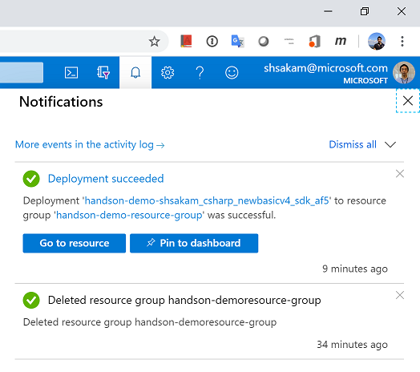
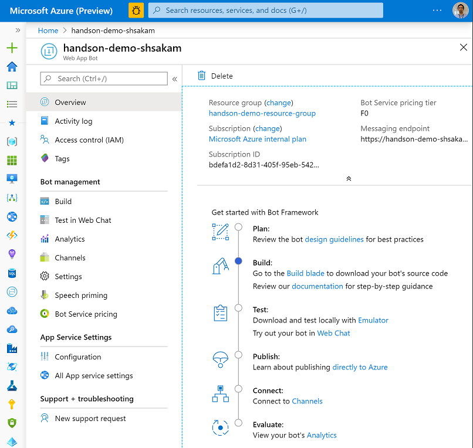
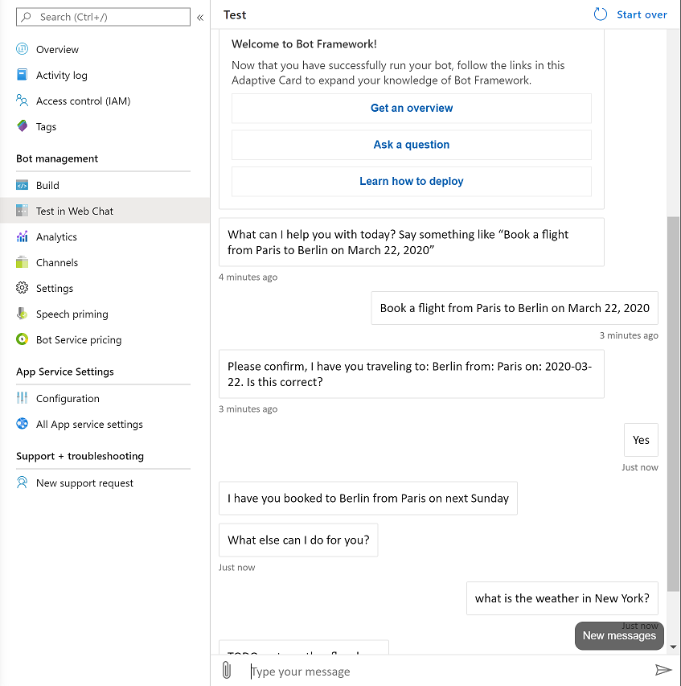

# 1. Azure Bot Services

Estimated Time: 20-30 minutes

## Create a Bot with the Azure Bot Service

The Azure Bot Service accelerates the process of developing a bot by provisioning a web host with one of five bot templates you can modify in an integrated environment that is purpose-built for bot development.

### Create a New Bot Service

To get started, we will create an instance of the bot service.

1. Navigate to the [Azure Portal](https://portal.azure.com).

2. Select **New** in the menu blade.

3. In the **New** blade, navigate to the **AI + Machine Learning** category, and select **Web App Bot**.

    ||
    |:-:|

4. In the Web App Bot blade, provide the following requested information:

    ||
    |:-:|

    |Setting|Purpose|Suggested setting|
    |-------|-------|-----------------|
    |Bot name|Resource name|handson-demo- + <your-name>, for example, handson-demo-shsakam|
    |Subscription|Subscription where to create bot.|Your primary subscription.|
    |Resource group|Logical group of Azure resources|Create a new group to store all resources used with this bot, name the group handson-demo-resource-group.|
    |Location|Azure region - this doesn't have to be the same as the LUIS authoring or publishing region|westus|
    |Pricing tier|Used for service request limits and billing.|F0 is the free tier.|
    |App name|The name is used as the subdomain when your bot is deployed to the cloud (for example, humanresourcesbot.azurewebsites.net).handson-demo- + <your-name>, for example, handson-demo-shsakam|
    |Bot template|Bot framework settings - see next table||
    |LUIS App location|Must be the same as the LUIS resource region|westus|
    |App service plan/Location|Do not change from provided default value.||
    |Application Insights|Do not change from provided default value.||
    |Microsoft App ID and password|Do not change from provided default value.||

5.In the **Bot template**, select the following, then choose the **Select** button under these settings:

   |Setting|Purpose|Selection|
   |-------|-------|---------|
   |SDK version|Bot framework version|SDK v4|
   |SDK language|Programming language of bot|C#|
   |Bot|Type of bot|Basic bot|

6. Select **Create**. This creates and deploys the bot service to Azure. Part of this process creates a LUIS app named handson-demo-XXXX. This name is based on the /Azure Bot Service app name.
Click **Create** to create the bot service and deploy it to the cloud.

7. Confirm that the bot service has been deployed.

    - Click **Notifications** (the bell icon that is located along the top edge of the Azure portal). The notification will change from **Deployment started** to **Deployment succeeded**.

    - After the notification changes to **Deployment succeeded**, click **Go to resource** on that notification.

  ||
  |:-:|

### Test Your New Bot

Now that your bot is running in the cloud, try it out by typing a few messages into the built-in chat control
that's located to the right of the code editor in Azure.
You should see that the bot responds to each message you send by echoing back your message prefixed with the text *You said*.

1. While still in the Azure portal for the new bot, select **Test in Web Chat** in left pane under Web App Bot Blade.

  ||
  |:-:|

2. Test your bot. Enter your request on Input Message box "Book a flight from Paris to Berline on March 22 2020"

  ||
  |:-:|

> **Up Next**: [2. Create your first LUIS app](../luis/readme.md)
