# 5. Microsoft Bot Framework Composer

Estimated Time: 60-90 minutes

## Overview

The Bot Framework Composer is an integrated development tool that developers and multi-disciplinary teams can use to build bots. It is built using the latest features of the Bot Framework SDK. Within Composer, you'll find everything you need to build a sophisticated conversational experience:

- A visual dialog editor.
- Tools to train and manage Language Understanding (LU).
- Powerful language generation and templating systems.
- A ready-to-use bot runtime executable .

    |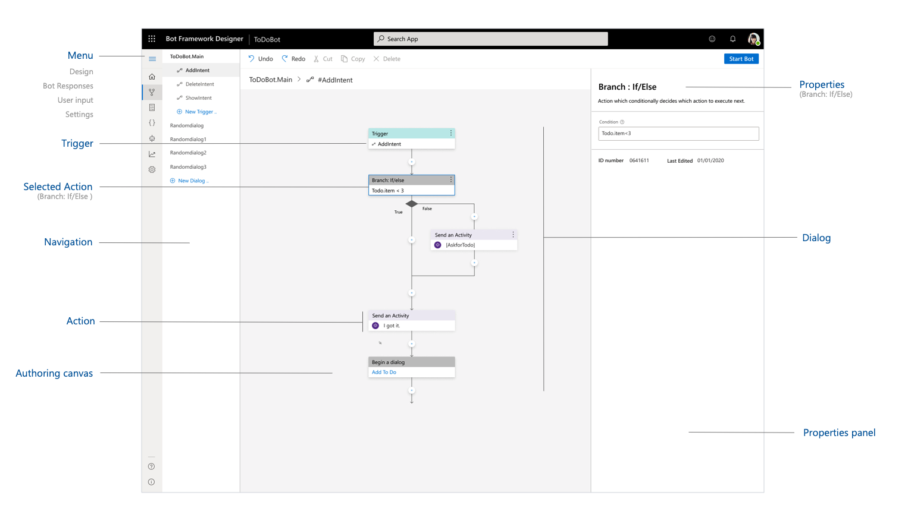|
    |:-:|

Microsoft Bot Composer [Document](https://github.com/microsoft/BotFramework-Composer)

## Prerequisites

All of the prerequisites for creating an echo bot are included in [Set up Bot Framework Composer with Yarn](https://github.com/microsoft/BotFramework-Composer/blob/stable/docs/setup-yarn.md).
 
## Create a new bot project
The first step in creating a bot with the Bot Framework Composer is to create a new bot project from the home screen in the Composer. This will create a new folder locally on your computer with all the files necessary to build, test and run the bot.

1. From the home screen, select **New**.

    |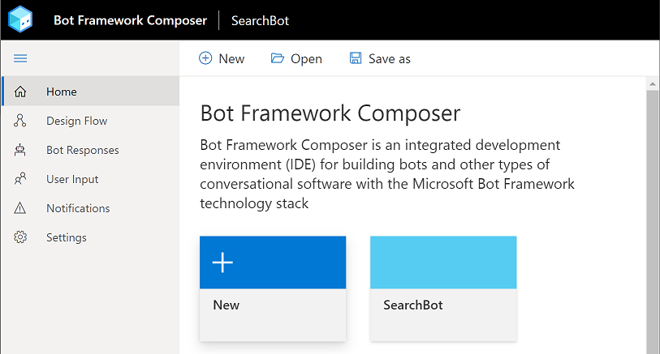|
    |:-:|

2. In the **Create from scratch?** screen, you'll be presented with options to create an empty bot project from scratch or to create one based on a template. For this tutorial, select the **Create from template** option, then select **QnA Maker and LUIS** and Click **Next**.

    |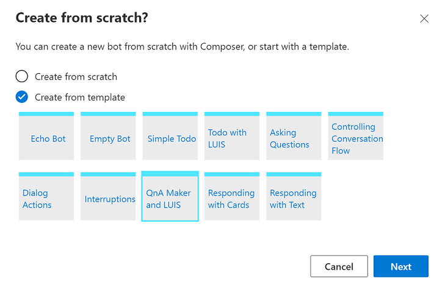|
    |:-:|

3. In the **Define conversation objective** form:
    1. Enter the name **QnAMakerLUIS** in the **Name** field.
    2. Enter **Your description** in the **Description** field.
    3. Select the location to save your bot.
    4. Save your changes and create your new bot by selecting **Next**.

    |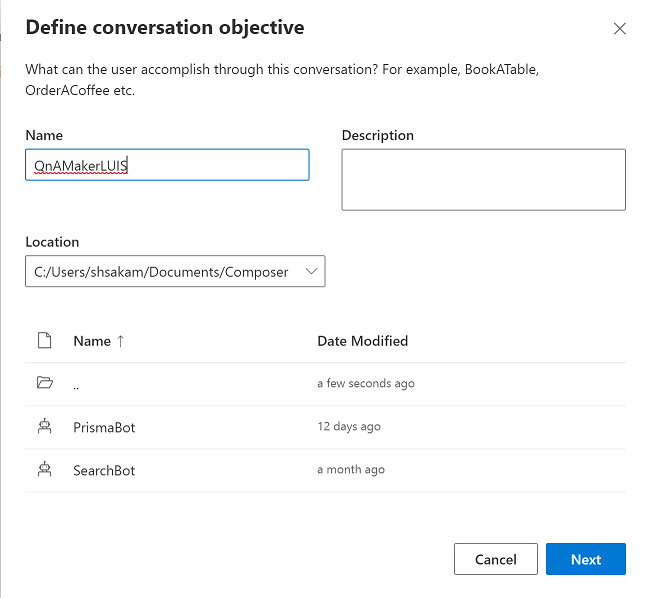|
    |:-:|

    > [!TIP] 
    > Spaces and special characters are not allowed in the bot's name.

4. Click the **Start Bot** button in the upper right hand corner of the screen.  This tells Composer to launch the bot's runtime, which is powered by the Bot Framework SDK. 

    |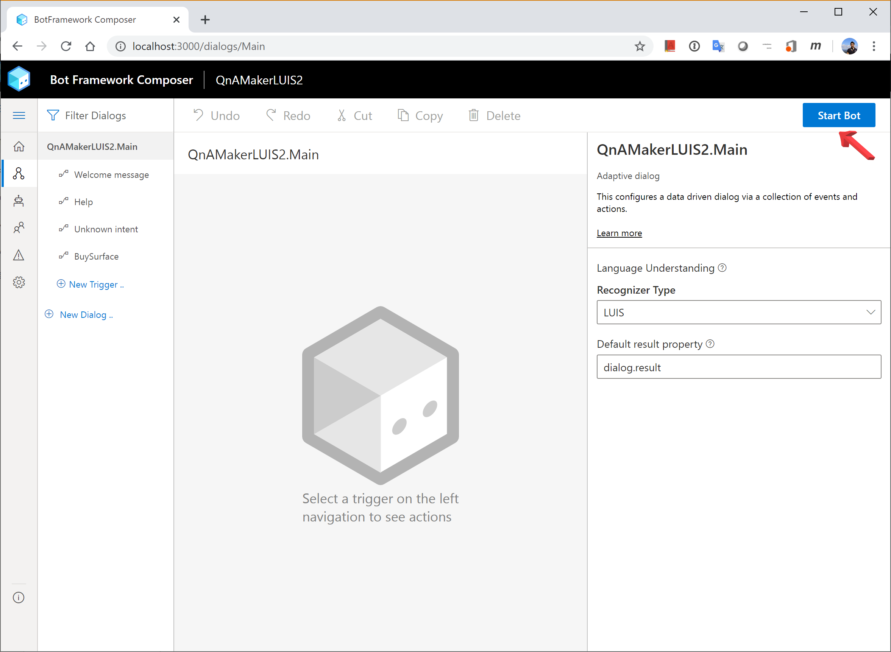|
    |:-:|

5. Open your LUIS portal [LUIS Portal](https://www.luis.ai/). Then open your profile from your account icon in upper right position then click **Settings**.

    |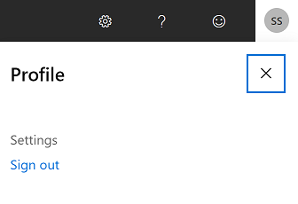|
    |:-:|

6. Copy the **Primary key** in your LUIS services.

    |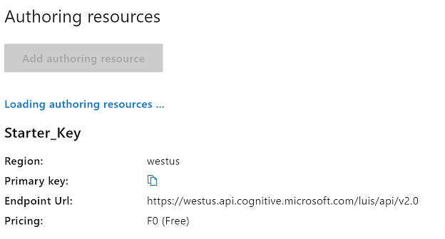|
    |:-:|
   
7. Paste the **Primary key** into the **LUIS Primary key:** Text box in the Publish LUIS models window, then click **OK**.

    |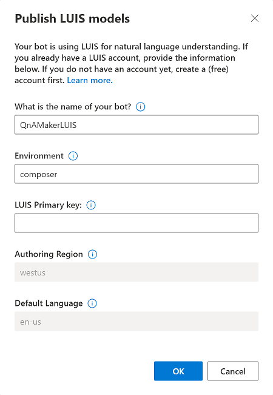|
    |:-:|

### Create New Trigger for Document Search
Each dialog in the Bot Framework Composer includes a set of triggers (event handlers) that contain actions (instructions) for how the bot will respond to inputs received when the dialog is active. There are several different types of triggers in Composer. They all work in a similar manner and can even be interchanged in some cases. This article explains how to define each type of trigger.

1. Click **New Trigger** in the left panel.

    |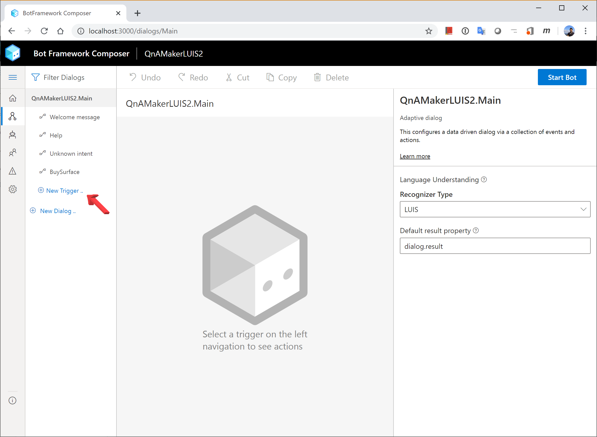|
    |:-:|

2. In the Create a trigger form:

    1. Enter the name **DocumentSearch** in the **What is the name of this trigger(LUIS)** field.
    2. Enter **- I want to search technical document** in the **Trigger phrases** field.
	3. And Click **Submit** button

    |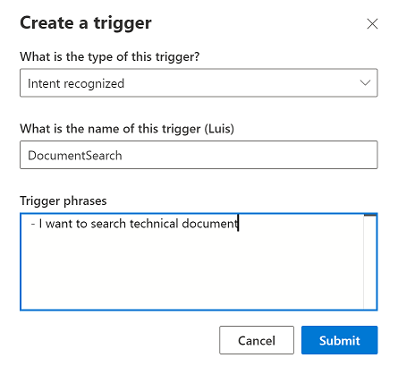|
    |:-:|

### Design Conversation Flow for comunicating with external services (Azure Search)
The conversations a bot has with its users are controlled by the content of its dialog. Dialogs contain templates for messages the bot will send, along with instructions for the bot to carry out tasks. While some dialogs are linear - just one message after the other - more complex interactions will require dialogs that branch and loop based on what the user says and the choices they make. This article explains how to add external HTTP request handling conversation flow.

1. In the DocumentSearch Dialog, Click + and select **Ask a question** and **Text input**

    |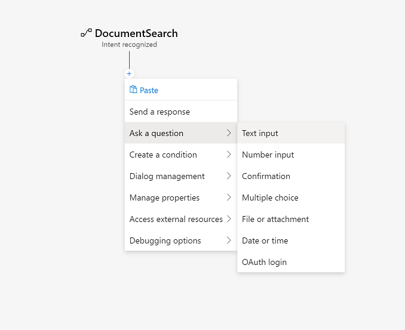|
    |:-:|

2. In the Text input form: Enter **- Please enter the search keyword?** in the **Prompt** field then click **User Input**.

    |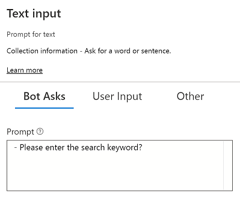|
    |:-:|

3. In the Text input form: Enter **user.Keyword** in the **Property to fill** Text Box. 

    |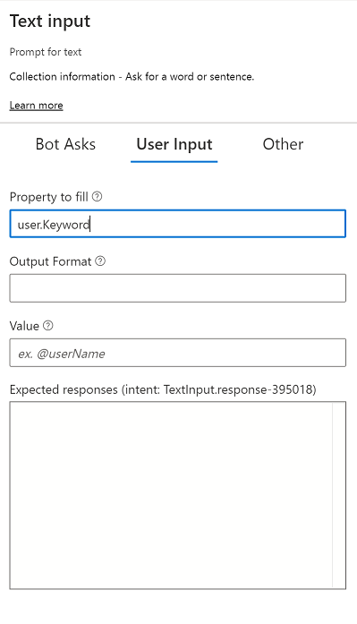|
    |:-:|

4. Click + under "User Input (Text)" module in the design window then select **Access external resources** and click **Send an HTTP request**. 

    |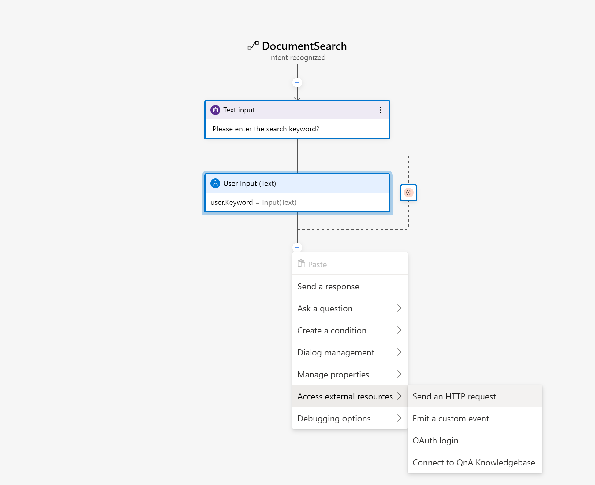|
    |:-:|

5. In the Send an HTTP request form:

    1. Select **GET** in the **HTTP method** field.
    2. Enter **https://prismasearch-search.search.windows.net/indexes/demoindex/docs?api-version=2019-05-06&search=${user.keyword}** in the **URL** field.
	3. And Enter **api-key** and **<your Azure Search subscription key>** in the **Headers** field.
	4. Enter **Content-Type** and **application/json** in the next **Headers** field.
	5. Enter **dialog.api_response** in the next **Result property** field.
	6. Select **Json** in the next **Response type** field.

    |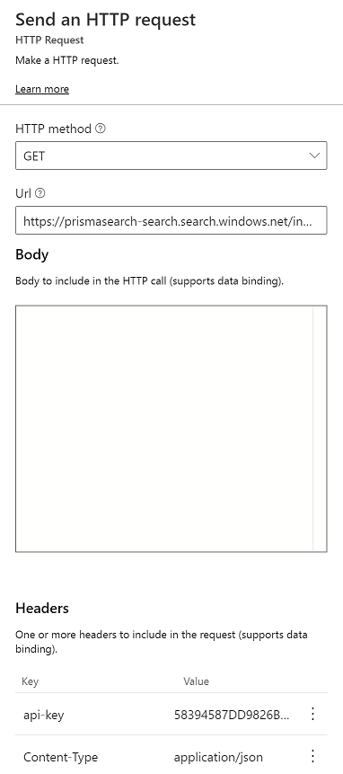|
    |:-:|

6. Click + under "Send an HTTP request" module in the design window then select **Create a condition** and click **Branch: if/else**

    |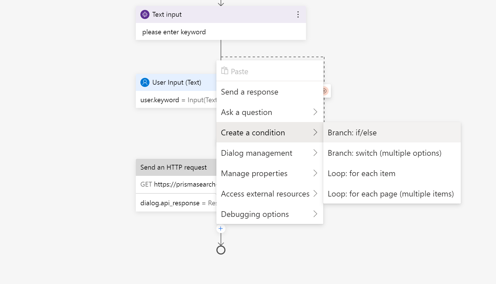|
    |:-:|

7. In the Branch: if/else form: Enter **dialog.api_response.statusCode==200** in the **Condition** Text Box. 

    |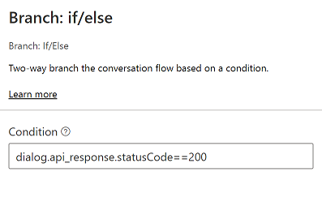|
    |:-:|

8. Click + under "Branch: if/else" module in the design window then click **Send a response**

    |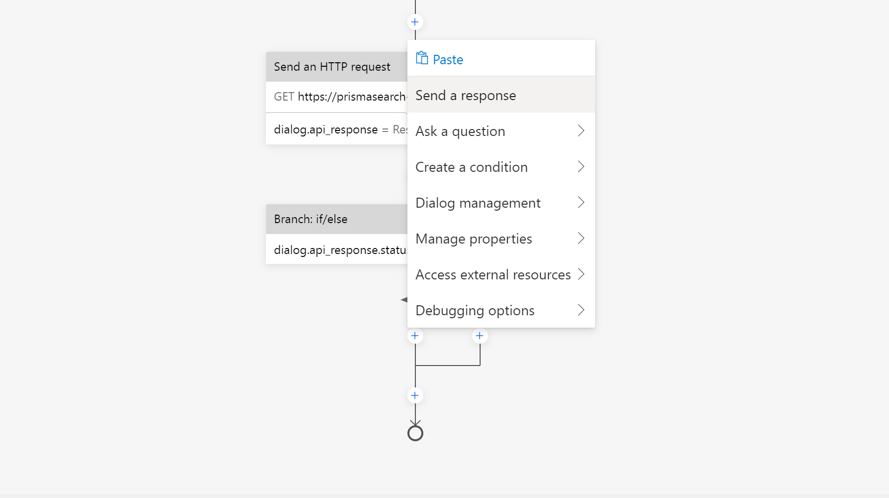|
    |:-:|

9. In the Send a response form: Enter **- 1st answer is \[${dialog.api_response.content.value\[0\].metadata_title}\](${dialog.api_response.content.value\[0\].metadata_storage_path})** in the **Language Generation** Text Box. 

    |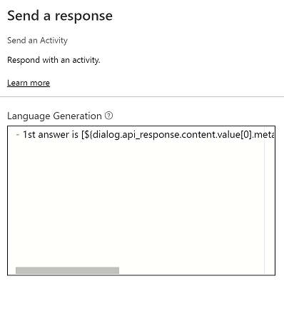|
    |:-:|

### Review QnA Maker integration settings
Add QnA Maker to your bot when you want to send a user question to your bot then have the QnA Maker knowledge base provide the answer.

Review the QnA Maker settings panel when selecting the QnA Maker dialog. While you can edit settings in the panel, a security best practice is to edit security-related settings (such as the endpoint key, knowledge base ID and hostname) from the Settings menu. This menu writes the values to the appsettings.json file and persists the values in the browser session. If you edit the settings from the QnA Maker settings panel, these settings are less secure because they are written to the dialog file.

1. Just select **Unknown intent** in the left side panel. This bot will try to answer from QnA Maker when he can't find any intent from end user request.

    |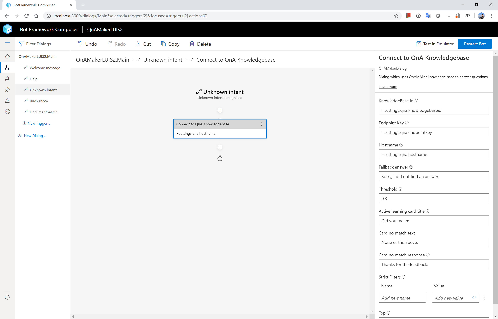|
    |:-:|

2. Securely editing the QnA Maker settings should be completed using Settings. These values are held in the browser session only.

    |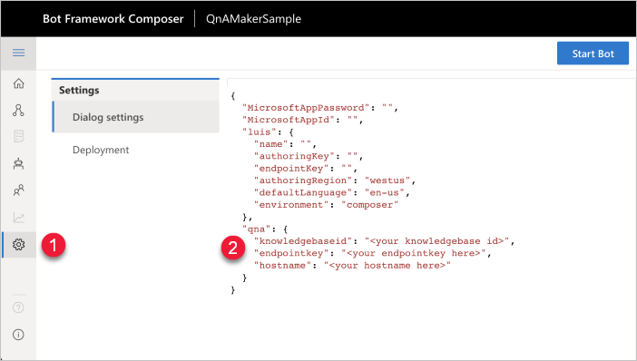|
    |:-:|

## Start your bot and test it

Now that your new bot has its first simple feature, you can launch it in the emulator and verify that it works.

1. Click the **Start Bot** button in the upper right hand corner of the screen.  This tells Composer to launch the bot's runtime, which is powered by the Bot Framework SDK.

    |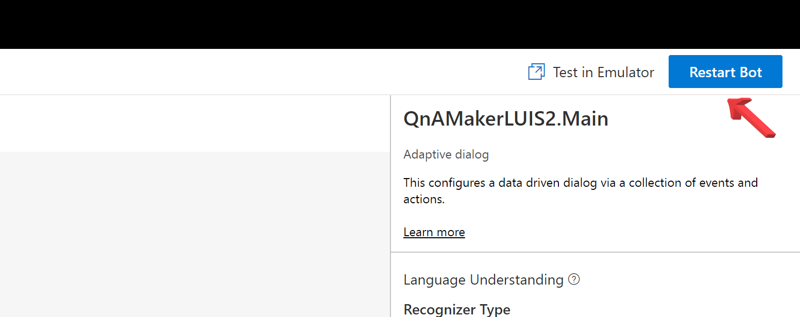|
    |:-:|

2. After a second the **Start Bot** button will change to **Restart Bot** which indicates that the bots runtime has started. Simultaneously a new link will appear next to the button labeled  **Test in Emulator**.  Selecting this link will open your bot in the Emulator. Soon the Emulator will appear, and the bot should immediately greet you with the message you just configured:

    |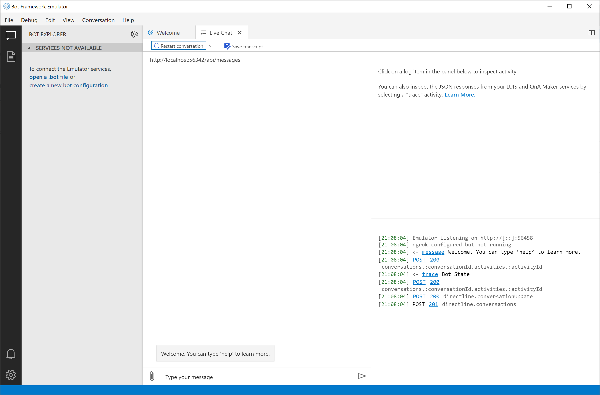|
    |:-:|

You now have a working bot, and you're ready to add some more substantial functionality!

3. Type "I'm looking for technical document" in the chatbox.

4. Type your search keyword after Chatbot asking you what is the search keyword.

    |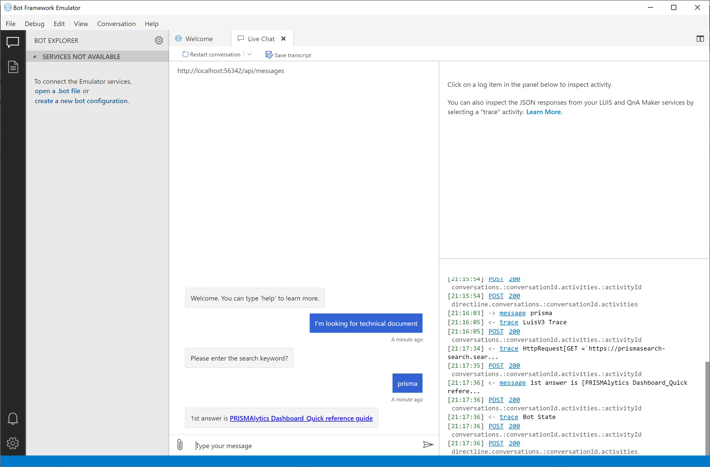|
    |:-:|
