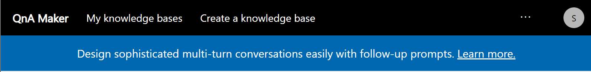
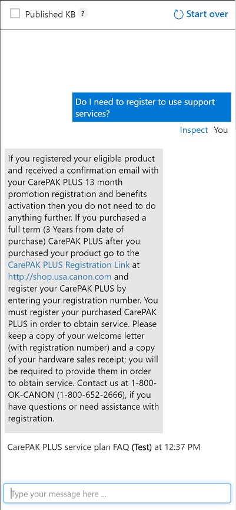

## Create your first QNA Maker Knowledge Base

One of the basic requirements in writing your own Bot service is to seed it with questions and answers. In many cases, the questions and answers already exist in content like FAQ URLs/documents, etc.

Microsoft QnA Maker is a free, easy-to-use, REST API and web-based service that trains AI to respond to user's questions in a more natural, conversational way. Compatible across development platforms, hosting services, and channels, QnA Maker is the only question and answer service with a graphical user interface—meaning you don’t need to be a developer to train, manage, and use it for a wide range of solutions.

With optimized machine learning logic and the ability to integrate industry-leading language processing with ease, QnA Maker distills masses of information into distinct, helpful answers.

### Create a Knowledge Base

Creating your knowledge base is as simple as pointing the QnA Maker tool to the existing content. The tool then extracts questions and answers.

1. In your browser, navigate to the **Canon USA, Inc. | FAQs** *CarePAK PLUS service plan Frequently Asked Questions* website: <https://www.usa.canon.com/internet/portal/us/home/explore/protection/faqs>.

1. Review the current FAQ questions.

1. Keep this web site for copying the URL later.

1. In another tab on your browser, navigate to the **QNA Maker** website: <https://qnamaker.ai/>.

1. Click the **Get Started** button. You may be prompted to login using your Azure credentials.

1. Once logged in, select the **Create a knowledge base** option.

    

1. **Step 1.** Create a QnA service in Microsoft Azure. Click the **Craeate a QnA service** button. Then follow the instruction for creating QnA Maker resources. website: <https://docs.microsoft.com/en-us/azure/cognitive-services/qnamaker/how-to/set-up-qnamaker-service-azure>.

    

1. **Step 2.** Click **Refresh** button and connect your QnA service to your Knowledge Base. Fill out the form by using your information that you've created in Step 1.

    - **Microsoft Azure Directory ID**:

    - **Azure subscription name**:

    - **Azure QnA service**:

    - **Language**: English

    

1. **Step 3.** Fill out the name for your Knowlege Base

    

1. **Step 4.** Copy and Paste the FAQs web site URL that you found in previous step and click **+ Add URL**

    

1. **Step 5.** Click the **Create your KB** button to parse the contents and create a new knowledge base.

    


### Train the Knowledge Base

The relevance of the responses is the most important part of your QnA service. The train feature lets you evaluate the correctness of the responses and correct them and re-train the knowledge base.

1. Once the questions have been processed and the service is created, you will see a landing page with your **Knowledge Base** and **QnA pairs**.

    


1. Click the **Test** button to begin training your knowledge base by chatting with a bot.

    


1. Start training the knowledge base by asking the following question. If the Bot provides an invalid answer, select the apporpriate answer from the alternatives on the right.:

    ```
    How much cost is the CarePAK PLUS for using my benefits?
    ```

    


1. Click the **Save and retrain** button at the top of the page to reflect any changes/inputs you have provided.

    


1. Click the **Test** button one more time to evaluate your knowledge updated.

    


### Publish and Validate the Knowledge Base

Once satisfied with the content and relevance of your knowledge base, you can proceed to publishing it as a service.


1. Click the **Publish** button at the top of the page.

    

1. Once satisfied with the preview, click the **Publish** button.

    

1. Record the information displayed in the **Sample HTTP request** section. This information will be used to validate your service.

1. In your browser, navigate to **Quickstart: Get an answer from knowledge base**: <https://docs.microsoft.com/en-us/azure/cognitive-services/qnamaker/quickstarts/get-answer-from-knowledge-base-using-url-tool?pivots=url-test-tool-postman>. Then use cURL or Postman to validate your QnA service.

    

1. Select the **POST** HTTP Method in the form to update the form with relevant options.

    

1. Click the **Add Header(s)** and **Add Body** links to expand the **Headers** and **Parameters** sections.

    

1. Fill out the HTTP request form by using the following values:
    
    - **URL**: concatenate the relative URL and the Host from your **POST**. For example, if the relative URL is ``/knowledgebases/355cd7f4-0e38-4fcd-b732-e3425b14cff2/generateAnswer`` and the Host is ``https://myqnamakerservice0308.azurewebsites.net/qnamaker``, the concatenated URL is ``https://myqnamakerservice0308.azurewebsites.net/qnamaker/knowledgebases/355cd7f4-0e38-4fcd-b732-e3425b14cff2/generateAnswer``

    - **Header Name**: ``Ocp-Apim-Subscription-Key``

    - **Header Value**: Use the subscription key value from your **Sample HTTP Request**.

    - **Body Parameter**: ``{ "question": "Is there conditions or limitations on the promotional CarePAK PLUS?" }``

    

1. Once the request has completed, you should see a status code of **200 OK** and a JSON response body.

    

    ```
    {
    "answers": [
        {
            "questions": [
                "Are there conditions or limitations on the promotional CarePAK PLUS?"
            ],
            "answer": "The only requirements are that the product be purchased during the promotion dates, be registered within 30 days, be included on the list of covered models, and be purchased from an authorized Canon USA dealer of from the Canon USA Website. Standard CarePAK PLUS limitations are still applicable including: Abuse, misuse, and fraud are not covered. For more detail, please refer to \"What is Not Covered (General Exclusions)\" in the Terms and Conditions.",
            "score": 98.0,    
		}
    ]
    }
    ```

> **Up Next**: [Automated ARM Deployment](arm.html)
