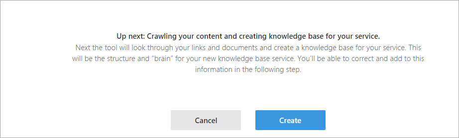

## Create your first QNA Maker Knowledge Base

One of the basic requirements in writing your own Bot service is to seed it with questions and answers. In many cases, the questions and answers already exist in content like FAQ URLs/documents, etc.

Microsoft QnA Maker is a free, easy-to-use, REST API and web-based service that trains AI to respond to user's questions in a more natural, conversational way. Compatible across development platforms, hosting services, and channels, QnA Maker is the only question and answer service with a graphical user interface—meaning you don’t need to be a developer to train, manage, and use it for a wide range of solutions.

With optimized machine learning logic and the ability to integrate industry-leading language processing with ease, QnA Maker distills masses of information into distinct, helpful answers.

### Create a Knowledge Base

Creating your knowledge base is as simple as pointing the QnA Maker tool to the existing content. The tool then extracts questions and answers.

1. In your browser, navigate to the **Capital One** *Credit Card Frequently Asked Questions* website: <https://www.capitalone.com/credit-cards/faq/>.

1. Review the current FAQ questions.

1. Download the following PDF file that contains the same questions: [faq.pdf](./assets/faq-capitalone_credit.pdf).

1. In your browser, navigate to the **QNA Maker** website: <https://qnamaker.ai/>.

1. Click the **Get Started** button. You may be prompted to login using your Azure credentials.

1. Once logged in, select the **Create new service** option.

    

2. Fill out the form by using the following values:

    - **Service Name**: Give you service a unique name

    - **URL(s)**: Leave this section blank

    - **Files**: Upload the PDF file you downloaded earlier in this exercise

    - **Starting from Scartch**: Skip this section

    

3. Click the **Create** button to upload your PDF file, parse the contents and create a new knowledge base.

    

### Train the Knowledge Base

The relevance of the responses is the most important part of your QnA service. The train feature lets you evaluate the correctness of the responses and correct them and re-train the knowledge base.

1. Once the questions have been processed and the service is created, you will see a landing page with your **Knowledge Base** and **QnA pairs**.

    

1. Click the **Test** button to begin training your knowledge base by chatting with a bot.

    


1. Start training the knowledge base by asking the following question. If the Bot provides an invalid answer, select the apporpriate answer from the alternatives on the left.:

    ```
    Can I get a copy of my credit report?
    ```

    

1. Ask the question below to continue training the knowledge base. If the Bot provides an invalid answer, select the apporpriate answer from the alternatives on the left.

    ```
    My credit card was stolen, can you lock it?
    ```

    

1. Ask the question below to continue training the knowledge base. If the Bot provides an invalid answer, select the apporpriate answer from the alternatives on the left.

    ```
    What is the interest rate for my account?
    ```

    

1. Click the **Save and retrain** button at the top of the page to reflect any changes/inputs you have provided.

    

### Publish and Validate the Knowledge Base

Once satisfied with the content and relevance of your knowledge base, you can proceed to publishing it as a service.


1. Click the **Publish** button at the top of the page.

    

1. Before the final publish, you can preview the changes that will affect the knowledge base on final publish. Download the diff file to see what changes will be published.

    

1. Once satisfied with the preview, click the **Publish** button.

    

1. Record the information displayed in the **Sample HTTP request** section. This information will be used to validate your service.

1. In your browser, navigate to **Hurl.it**: <https://www.hurl.it/> (the website does not seem to work anymore), or **ExtendsClass.com**: <https://extendsclass.com/rest-client-online.html>.

    

1. Select the **POST** HTTP Method in the form to update the form with relevant options.

    

1. Click the **Add Header(s)** and **Add Body** links to expand the **Headers** and **Parameters** sections.

    

1. Fill out the HTTP request form by using the following values:
    
    - **URL**: concatenate the relative URL and the Host from your **Sample HTTP Request**. For example, if the relative URL is ``/knowledgebases/ad8107f8-e9ab-44c0-920c-d8faf388c29d/generateAnswer`` and the Host is ``https://westus.api.cognitive.microsoft.com/qnamaker/v2.0``, the concatenated URL is ``https://westus.api.cognitive.microsoft.com/qnamaker/v2.0/knowledgebases/ad8107f8-e9ab-44c0-920c-d8faf388c29d/generateAnswer``

    - **Header Name**: ``Ocp-Apim-Subscription-Key``

    - **Header Value**: Use the subscription key value from your **Sample HTTP Request**.

    - **Body Parameter**: ``{ "question": "Is there a fee to use my card overseas?" }``

    

1. Complete the **reCAPTCHA** to verify that you are a real human and then click the **Launch Request** button.

1. Once the request has completed, you should see a status code of **200 OK** and a JSON response body.

    

    ```
    {
    "answers": [
        {
        "answer": "Capital One does not charge a fee for using your credit card for foreign currency transactions. Foreign  purchases will be converted at the foreign exchange rate in effect at the time of processing the charge.  Read more about foreign transaction and currency conversion fees.",
        "questions": [
            "Will Capital One charge me a fee if I use my credit card overseas?"
        ],
        "score": 79.668956726789474
        }
    ]
    }
    ```

> **Up Next**: [Automated ARM Deployment](arm.html)
